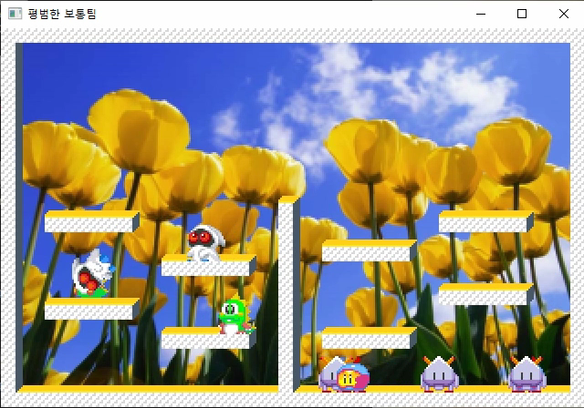
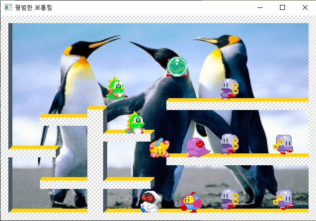

# 버블버블 온라인
오락실 게임으로 유명한 버블버블 메모리즈를 온라인으로 구현한 게임입니다. 별도의 게임제작 엔진은 사용하지 않고 구현했습니다.

  
  

사용자는 서버에 접속한 뒤 게임방을 만들거나 만들어진 게임방에 참여한 뒤 참여인원끼리의 게임을 시작합니다.대기방의 로직은 크레이지 아케이드의 형식과 같습니다.

# 서버 환경
 - OS : Windows 10
 - 언어 : C++
 - 라이브러리 : jsoncpp
 - 단일프로세스 멀티스레드 구조

# 클라이언트 환경
 - OS : Windows 10
 - 언어 : C++
 - 라이브러리 : jsoncpp
 - IOCP 기반 비동기 통신

# 자체 제작
 - PBFramework (평범한 보통팀 프레임워크)
 - 스프라이트 툴 (C#)
 - 애니메이션 툴 (C#)
 - 맵툴 (C#)

# 리소스 출처
* [스프라이트 리소스 1](https://www.spriters-resource.com/arcade/bubmem/sheet/16218/?source=genre)
* [스프라이트 리소스 2](https://www.spriters-resource.com/arcade/bubmem/sheet/16217/)

## 실행결과
* [유튜브 영상 보기](https://www.youtube.com/watch?v=R1XptGWzaCE)
